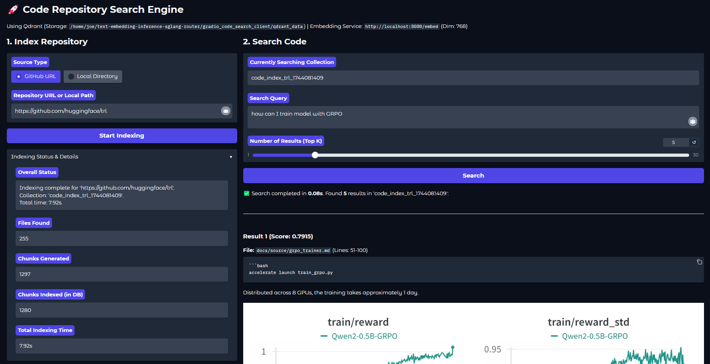

## Gradio Code Search App



This directory (`gradio_code_search/`) contains a standalone Gradio application that provides a user interface for indexing and semantically searching code repositories.

**Core Functionality:**

1.  **Indexing:**
    *   Ingests code from **GitHub repositories** (via cloning) or **local directories**.
    *   Recursively finds code files based on common extensions (configurable in `config.py`).
    *   Chunks files into segments (line count configurable in `config.py`).
    *   Uses an **asynchronous pipeline** (`indexing.py`) for efficiency:
        *   **Parallel file reading & chunking:** Uses a thread pool (`ThreadPoolExecutor`) to avoid blocking during I/O and processing.
        *   **Concurrent embedding generation:** Calls the external embedding service endpoint (specified in `.env`) in batches, limiting concurrency (`embedding_client.py`, `config.py`). Includes retries for robustness.
        *   **Non-blocking database upserts:** Sends embedding vectors and metadata (file path, line numbers, code text) to a local Qdrant instance using a thread pool to prevent UI freezes (`qdrant_logic.py`).
2.  **Storage:**
    *   Manages its **own independent vector index** using a local Qdrant instance (path configurable via `QDRANT_STORAGE_LOCATION` in `.env`, defaults to `./qdrant_data/`). This index is separate from any potential caching layers used by the embedding service itself.
3.  **Search:**
    *   Accepts natural language queries.
    *   Generates an embedding for the query using the same external service.
    *   Performs a similarity search against the local Qdrant index for the relevant code chunks.
    *   Displays the top K results with code snippets, file paths, and line numbers.

**Architecture:**

The application is modularized for better maintainability:

*   `app.py`: Main Gradio UI definition and application entry point.
*   `config.py`: Loads configuration from `.env` and defines constants (batch sizes, workers, etc.).
*   `utils.py`: Helper functions for file operations, validation, logging, etc.
*   `embedding_client.py`: Handles interaction with the external embedding service endpoint, including batching and retries.
*   `qdrant_logic.py`: Manages interaction with the local Qdrant vector database (initialization, collection setup, upserts, search).
*   `indexing.py`: Orchestrates the asynchronous indexing pipeline, coordinating file processing, embedding generation, and database upserts.
*   `.env`: File for storing environment-specific configuration (required).
*   `requirements.txt`: Python dependencies for the Gradio app.

**To run the Gradio app:**

1.  **Navigate:** Change into the application directory:
    ```bash
    cd gradio_code_search
    ```
2.  **Environment (Recommended):** Create and activate a Python virtual environment:
    ```bash
    python -m venv venv
    source venv/bin/activate # On Windows: venv\Scripts\activate
    ```
3.  **Install Dependencies:** Install the required Python packages:
    ```bash
    pip install -r requirements.txt
    ```
4.  **Configure `.env`:** Create a `.env` file in the `gradio_code_search` directory. **At minimum**, you must define:
    *   `EMBEDDING_ENDPOINT_URL`: The full URL of your running embedding service (e.g., `http://localhost:8080/embed`).
    *   `EMBEDDING_DIMENSION`: The vector dimension expected by your embedding model (e.g., `768`).
    *   *(See `config.py` for other optional overrides like `QDRANT_STORAGE_LOCATION`, `FILE_PROCESSING_WORKERS`, `EMBEDDING_CONCURRENCY_LIMIT`, `UPSERT_BATCH_SIZE` etc.)*
5.  **Ensure Embedding Service is Running:** The Gradio app needs to be able to reach the `EMBEDDING_ENDPOINT_URL` you specified. Make sure your external embedding service is running and accessible.
6.  **Run the App:** Start the Gradio application:
    ```bash
    python app.py
    ```
7.  **Access:** Open the local URL displayed in your terminal (usually `http://127.0.0.1:7860`) in your web browser.

Now you can use the UI to index repositories and search through your code!