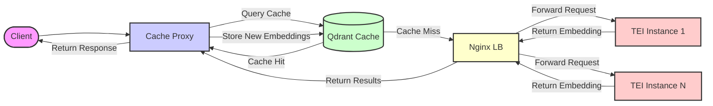

# Multi-GPU TEI Deployment with Qdrant Cache and Nginx Load Balancer

This repository provides a configuration to serve a Hugging Face text embedding model using `text-embeddings-inference` (TEI) deployed across multiple GPUs. It includes a caching layer built with FastAPI and Qdrant to optimize performance for repeated requests, and uses Nginx internally to load balance requests to the TEI instances for cache misses.

See blog post here: https://chaochunhsu.github.io/patterns/blogs/tei_qdrant_cache/

## Architecture

The following diagram illustrates the request flow:



## Directory Structure

```
tei-nginx-qdrant-cache/
├── .env                  # Environment variables (REQUIRED)
├── docker-compose.yml    # Generated by script
├── generate_configs.py   # Python script to generate configs
├── nginx/                # Nginx configuration directory
│   └── nginx.conf        # Generated by script
├── cache_proxy/          # FastAPI Cache Proxy service code
│   ├── Dockerfile
│   ├── main.py
│   ├── requirements.txt
│   ├── config.py
│   ├── schemas.py
│   └── qdrant_utils.py
│── README.md             # This file
└── gradio_code_search/   # Example use case
```

## Prerequisites
*   Docker Compose
*   [NVIDIA Container Toolkit](https://docs.nvidia.com/datacenter/cloud-native/container-toolkit/latest/install-guide.html) (to allow Docker containers access to GPUs)
*   A multi-GPU machine (or adjust `NUM_REPLICAS` for single GPU testing)

## Example
See example of repository retreival in `gradio_code_search/` after finishing embedding server setup.

## Configuration

1.  **Clone the repository:**
    ```bash
    git clone https://github.com/joe32140/tei-qdrant-cache.git
    cd tei-qdrant-cache
    ```
2.  **Prepare the Cache Proxy Code:** Ensure the `cache_proxy/` directory exists and contains all the necessary Python files (`main.py`, `config.py`, `schemas.py`, `qdrant_utils.py`), `requirements.txt`, and the `Dockerfile`.

3.  **Create/Edit the `.env` file:**
    This file is crucial for configuring the entire stack. Create a `.env` file in the root directory. You will need to define the following variables within it:

    **Environment Variables (`.env` file):**

    *   **Model Configuration:**
        *   `MODEL_ID`: Specifies the Hugging Face model ID (e.g., `BAAI/bge-large-en-v1.5`) to be used by the TEI instances for generating embeddings. **Crucially, ensure the chosen model is compatible with Text Embeddings Inference.**
        *   `EMBEDDING_DIMENSION`: The output dimension (size) of the embedding vectors produced by the `MODEL_ID`. **This is CRITICAL and MUST be set correctly** for Qdrant to initialize the cache collection properly. Find this value on the model's Hugging Face page or documentation.
        *   `AUTO_TRUNCATE` (Optional): Set to `True` to automatically truncate input texts that exceed the model's maximum sequence length. Set to `False` (or omit) to return an error for oversized inputs. Defaults vary by TEI version; setting explicitly is recommended.
        *   `REVISION` (Optional): Specify a specific model revision (like a branch name, tag, or commit hash) from the Hugging Face Hub. Defaults to the `main` branch if omitted.

    *   **Deployment Configuration:**
        *   `NUM_REPLICAS`: The number of TEI inference instances to run. Typically, set this to the number of GPUs you want to utilize (e.g., `8` for 8 GPUs).
        *   `HOST_PORT`: The external port on your host machine that will expose the Cache Proxy service. Clients will send embedding requests to `http://<your-host-ip>:<HOST_PORT>/embed`. Example: `8080`.

    *   **TEI Container Configuration:**
        *   `TEI_IMAGE`: The Docker image to use for the Text Embeddings Inference service. You can specify a version tag (e.g., `ghcr.io/huggingface/text-embeddings-inference:1.6`) or use `latest` (e.g., `ghcr.io/huggingface/text-embeddings-inference:latest`). Using a specific version is recommended for production stability.
        *   `MAX_BATCH_TOKENS`: Controls the maximum number of tokens the TEI server will process in a single inference batch across concurrent requests. Adjust based on your model's requirements and available GPU memory. Example: `16384`.
        *   `DTYPE` (Optional): Specifies the data type for model computations (e.g., `float16`). Can improve performance and reduce memory usage on compatible hardware. Leave commented out or omit to use TEI's default.
        *   `HUGGING_FACE_HUB_TOKEN` (Optional): Your Hugging Face Hub token (starting with `hf_`), required only if `MODEL_ID` points to a private or gated model that needs authentication for download.
        * See more details in https://github.com/huggingface/text-embeddings-inference .
    *   **Qdrant Cache Configuration:**
        *   `QDRANT_COLLECTION`: The name for the collection (similar to a table) within Qdrant where the text embeddings will be cached. Example: `text_embedding_cache`.
        *   `QDRANT_HOST`: The hostname of the Qdrant service *within the Docker network*. This **must match the service name** defined for Qdrant in the `docker-compose.yml` file (e.g., `qdrant` if the service is named `qdrant`).
        *   `QDRANT_PORT`: The internal gRPC port used by the Qdrant service within the Docker network. The default is `6333`.

    *   **Cache Proxy Configuration:**
        *   `NGINX_UPSTREAM_URL`: The internal URL that the Cache Proxy uses to forward cache miss requests to the Nginx load balancer. This **must match the scheme, service name, and port** of the Nginx service defined in `docker-compose.yml`. Example: `http://nginx-internal-lb:80` (if the Nginx service is named `nginx-internal-lb` and listens on port 80 internally).
        *   `CACHE_HASH_FUNCTION`: The hashing algorithm used by the Cache Proxy to generate unique IDs from input texts for caching. Options include `sha256` (recommended for low collision risk) or `md5` (faster but theoretically higher collision risk). Example: `sha256`.

    **Make sure to set `MODEL_ID` and the corresponding `EMBEDDING_DIMENSION` correctly.** Adjust `NUM_REPLICAS` based on your available GPUs. Verify internal service names (`QDRANT_HOST`, `NGINX_UPSTREAM_URL`) align with your `docker-compose.yml` (which is generated by the script based on defaults).

4.  **Generate Configuration Files:**
    Run the Python script. It reads the `.env` file you just created and generates/overwrites `docker-compose.yml` and `nginx/nginx.conf`.
    ```bash
    python generate_configs.py
    ```
    Verify the output indicates successful generation. You can inspect the generated files to ensure they reflect your `.env` settings.

## Usage

1.  **Build and Start the Services:**
    *(Ensure you have run `python generate_configs.py` first)*
    Use `docker compose up`. The `--build` flag is necessary the first time or whenever you change the code in the `cache_proxy` directory. The `-d` flag runs the containers in detached mode (in the background).
    ```bash
    docker compose up -d --build
    ```
    This will:
    *   Build the `cache-proxy` Docker image.
    *   Pull the Qdrant, Nginx, and TEI images.
    *   Create the Docker network and volumes.
    *   Start all containers based on the generated `docker-compose.yml`.
    The first time, TEI containers might take a while to download the specified model into the shared `tei-model-cache` volume. Qdrant will initialize its storage in the `qdrant-storage` volume.

2.  **Check Container Status:**
    ```bash
    docker compose ps
    ```
    You should see the `cache-proxy`, `qdrant-db`, `nginx-internal-lb`, and all `tei-X` containers in a running state.

3.  **Monitor Logs (Highly Recommended):**
    Tail the logs of specific services to check for errors or monitor activity.
    ```bash
    docker compose logs -f cache-proxy   # Check for cache hits/misses, Qdrant interactions, errors
    docker compose logs -f qdrant-db     # Check Qdrant startup and activity
    docker compose logs -f nginx-internal-lb # Check requests forwarded from cache-proxy
    docker compose logs -f tei-0         # Check model loading and inference logs for one TEI instance
    # Use 'docker compose logs -f' to view all logs
    ```
    Look for successful initialization messages from Qdrant and TEI, and watch the `cache-proxy` logs for request processing details (cache hits vs. misses, forwarding to Nginx).

4.  **Test the Embedding Endpoint:**
    Send POST requests to the **Cache Proxy service** on the `HOST_PORT` you configured in `.env`.

    ```bash
    # Example using curl
    # First request for this text (should be a cache miss)
    curl http://localhost:8080/embed \
      -X POST \
      -d '{"inputs": "This is the first request for this text."}' \
      -H 'Content-Type: application/json'

    # Send the *exact same* input again (should be a cache hit)
    curl http://localhost:8080/embed \
      -X POST \
      -d '{"inputs": "This is the first request for this text."}' \
      -H 'Content-Type: application/json'

    # Send multiple inputs, some new, some potentially cached
    curl http://localhost:8080/embed \
      -X POST \
      -d '{"inputs": ["This is a new text.", "This is the first request for this text.", "Another new one."]}' \
      -H 'Content-Type: application/json'
    ```
    *(Replace `localhost:8080` if your `HOST_PORT` is different or if accessing remotely)*

    *   **Observe:** The very first request for a specific text should trigger a cache miss (check `cache-proxy` logs) and might take slightly longer as it involves TEI inference. Subsequent requests with the *exact same text* should be significantly faster (cache hit). Requests with mixed cached/new texts will retrieve cached ones quickly and compute only the new ones.
    * **Load Test** You can run `python load_test_embed.py` to test your endpoint.

5.  **Stop the Services:**
    ```bash
    docker compose down
    ```
    This stops and removes the containers but leaves the Docker volumes (`tei-model-cache`, `qdrant-storage`) intact, preserving your downloaded model and cached embeddings. To remove the volumes as well (deleting the model and cache):
    ```bash
    docker compose down -v
    ```

6.  **Reset Qdrant docker volumn (optional)**

    Remove exsiting Qdrant database by:
    ```bash
    docker volume rm qdrant-storage
    ```

## Scaling / Changing GPU Count

To change the number of TEI instances:

1.  **Stop the services (if running):**
    ```bash
    docker compose down
    ```
2.  **Update `NUM_REPLICAS` in `.env`** to the new desired number of GPUs/instances.
3.  **Regenerate the configuration files:**
    ```bash
    python generate_configs.py
    ```
    This will update `docker-compose.yml` (number of `tei-X` services and dependencies) and `nginx/nginx.conf` (upstream server list).
4.  **Restart the services:**
    ```bash
    docker compose up -d # --build is likely not needed unless cache_proxy code changed
    ```
    Docker Compose will adjust the running containers to match the new configuration.


*   **`EMBEDDING_DIMENSION`:** Setting this correctly in `.env` is critical for Qdrant to function properly. Find the dimension from your model's documentation or Hugging Face page.
*   **Cache Invalidation:** This setup caches embeddings indefinitely based on the hash of the input text. There's no built-in mechanism for automatic cache invalidation (e.g., based on time or if the model changes). To force re-computation, you would need to manually clear the Qdrant collection (e.g., via Qdrant's API or UI if exposed) or implement a TTL mechanism within the `cache_proxy` service.
*   **Hashing:** Using SHA256 is generally recommended for minimal collision risk. MD5 is faster but carries a theoretically higher (though still very low for typical text inputs) chance of collisions. The hash function is configured via `CACHE_HASH_FUNCTION` in `.env`.
*   **Performance:**
    *   Cache hits should be very fast, dominated by network latency to the proxy and Qdrant lookup time.
    *   Cache misses incur the overhead of hashing, Qdrant lookup (miss), forwarding to Nginx, TEI inference (potentially batched), and storing the result back in Qdrant (potentially async). This path will be slightly slower than hitting TEI directly *without* caching involved.
    *   Ensure Qdrant has sufficient resources (CPU/RAM). Monitor its performance if caching becomes a bottleneck under heavy load.
*   **Error Handling:** The cache proxy includes basic error handling for Qdrant and TEI communication failures. Check its logs (`docker compose logs -f cache-proxy`) for details if requests fail.
*   **Resource Usage:** This setup runs multiple TEI instances (GPU-intensive), Nginx, Qdrant (RAM/CPU/Disk intensive), and the Cache Proxy (CPU/RAM intensive). Ensure your host machine has sufficient CPU, RAM, and GPU memory for the configured number of replicas.
*   **Security:** The `HOST_PORT` exposes the Cache Proxy. Apply firewall rules as needed. Ensure sensitive information (like `HUGGING_FACE_HUB_TOKEN`) in `.env` is protected and not committed to version control if the repository is public.
