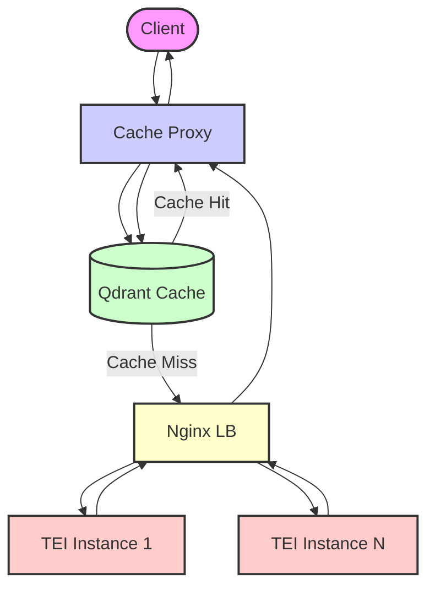

# Report: Multi-GPU Text Embedding Service with Qdrant Caching

## 1. Introduction

This report summarizes the design and implementation of a system for serving text embeddings using multiple GPUs, incorporating a caching layer to enhance performance and reduce redundant computations. The goal was to leverage Hugging Face's `text-embeddings-inference` (TEI) across several GPUs while implementing a cache based on input text hashes, using Qdrant as the persistent cache store. The final architecture utilizes FastAPI for the caching proxy, Qdrant for the cache, Nginx for internal load balancing, and Docker Compose for orchestration.

## 2. Final Architecture

The system consists of the following components interacting in a specific flow:

1.  **Client:** Initiates requests to the `/embed` endpoint.
2.  **Cache Proxy (FastAPI Service):** The primary entry point.
    *   Receives the client request.
    *   Calculates a hash (SHA256) for each input text.
    *   Converts the hash into a UUID (using the first 16 bytes).
    *   Queries Qdrant using the UUIDs (as strings) to check for cached embeddings.
    *   **Cache Hit:** If all requested embeddings are found in Qdrant, retrieves them and returns the result directly to the client.
    *   **Cache Miss:** If one or more embeddings are missing:
        *   Identifies the texts needing computation.
        *   Forwards a request containing *only the missing texts* to the internal Nginx Load Balancer.
        *   Receives the computed embeddings from Nginx.
        *   Asynchronously stores the newly computed embeddings (Text -> UUID -> Vector) in Qdrant for future requests.
        *   Combines the cached results (if any) with the newly computed results.
        *   Returns the complete set of embeddings to the client.
3.  **Qdrant (Vector Database):**
    *   Acts as the persistent cache store.
    *   Stores embedding vectors keyed by the UUID derived from the input text hash.
    *   Uses a Docker volume (`qdrant-storage`) for persistence.
4.  **Nginx (Internal Load Balancer):**
    *   Receives requests *only* from the Cache Proxy on cache misses.
    *   Uses a configured strategy (e.g., round-robin) to distribute these requests across the available TEI instances.
    *   Runs within the Docker network and is not exposed externally.
5.  **TEI Instances (Text Embeddings Inference):**
    *   Multiple container instances (one per GPU).
    *   Receive inference requests from Nginx.
    *   Compute embeddings for the provided texts using the configured Hugging Face model and assigned GPU.
    *   Return results to Nginx.

## 3. Component Implementation Details

*   **Cache Proxy (`cache_proxy/`):**
    *   Built with **FastAPI**.
    *   Uses **Uvicorn** (potentially with Gunicorn) as the ASGI server.
    *   Handles incoming requests, JSON parsing (`orjson`), text hashing (`hashlib`), and UUID generation (`uuid`).
    *   Interacts with Qdrant using the **`AsyncQdrantClient`** for non-blocking database operations.
    *   Interacts with the internal Nginx load balancer using the **`httpx.AsyncClient`** for non-blocking downstream requests.
    *   Configuration loaded from `.env` using `pydantic-settings`.
    *   Contains specific modules for configuration (`config.py`), data validation (`schemas.py`), Qdrant interaction (`qdrant_utils.py`), and the main application logic (`main.py`).
*   **Qdrant:**
    *   Standard `qdrant/qdrant` Docker image.
    *   Collection is created automatically on startup by the Cache Proxy if it doesn't exist.
    *   Point IDs are **UUIDs stored as strings**, derived from input text hashes.
*   **Nginx:**
    *   Standard `nginx` Docker image.
    *   Configuration (`nginx.conf`) is generated dynamically to list the TEI instances as upstream servers.
    *   Acts purely as an internal load balancer.
*   **TEI Instances:**
    *   Uses the official `ghcr.io/huggingface/text-embeddings-inference` image (version configurable via `.env`).
    *   Each instance is assigned a specific GPU via the `deploy.resources` section in `docker-compose.yml`.
    *   Model (`MODEL_ID`) and other parameters (`MAX_BATCH_TOKENS`, etc.) configured via `.env`.
    *   Shares a common Docker volume (`tei-model-cache`) for efficient model storage.
*   **Orchestration & Configuration:**
    *   **Docker Compose (`docker-compose.yml`):** Defines all services, networks, volumes, dependencies, and resource allocations (GPUs). Generated dynamically.
    *   **`.env` File:** Centralizes all user-configurable parameters (model ID, embedding dimension, replica count, ports, image versions, Qdrant settings, etc.). **`EMBEDDING_DIMENSION` is critical.**
    *   **Generation Script (`generate_configs.py`):** Reads `.env` and generates the `docker-compose.yml` and `nginx/nginx.conf` files, enabling easy scaling and configuration changes by modifying only the `.env` file.

## 4. Caching Mechanism Summary

*   **Key:** UUID derived from the SHA256 hash of the input text.
*   **Value:** Embedding vector (list of floats).
*   **Store:** Qdrant collection.
*   **Lookup:** By UUID (converted to string for Qdrant client).
*   **Population:** On cache miss, after successful inference by TEI.
*   **Format:** Point IDs in Qdrant are UUID strings.

## 5. Deployment & Usage

1.  **Prerequisites:** Docker, Docker Compose, Python, NVIDIA Drivers, NVIDIA Container Toolkit.
2.  **Setup:** Clone repo, ensure `cache_proxy` code is present, configure `.env` (esp. `MODEL_ID`, `EMBEDDING_DIMENSION`, `NUM_REPLICAS`).
3.  **Generate Configs:** Run `python generate_configs.py`.
4.  **Build & Start:** Run `docker compose up -d --build`.
5.  **Monitor:** Use `docker compose logs -f <service_name>` (especially `cache-proxy`).
6.  **Test:** Send POST requests to `http://<host>:<HOST_PORT>/embed`. Observe faster responses for repeated identical inputs.

## 6. Key Decisions & Rationale

*   **Dedicated Cache Proxy:** Provides better separation of concerns and more straightforward logic for cache population compared to embedding caching directly within Nginx (e.g., via Lua).
*   **Qdrant as Cache:** Chosen for persistence, shareability, and scalability, although Redis could be a simpler alternative for pure key-value caching. Using UUIDs derived from hashes provides a Qdrant-compatible key.
*   **Async Implementation:** The Cache Proxy uses `async def` endpoints, `AsyncQdrantClient`, and `httpx.AsyncClient` to maximize concurrency and avoid blocking the server during I/O operations (Qdrant queries, TEI requests).
*   **Internal Nginx:** Simplifies the Cache Proxy by offloading the load balancing task for cache misses to a standard, robust component.
*   **Dynamic Configuration:** Using `.env` and `generate_configs.py` makes scaling (`NUM_REPLICAS`) and configuration changes much easier than manually editing `docker-compose.yml` and `nginx.conf`.

## 7. Potential Improvements & Considerations

*   **Cache Invalidation/TTL:** The current cache stores items indefinitely. Implementing Time-To-Live (TTL) or an invalidation mechanism might be necessary.
*   **Error Handling:** More sophisticated retries or circuit breaking could be added for Qdrant or TEI interactions.
*   **Metrics & Monitoring:** Integrate monitoring (e.g., Prometheus/Grafana) to track cache hit rates, latencies, Qdrant performance, etc.
*   **Hashing Strategy:** While SHA256->UUID is robust, explore alternatives if hash generation becomes a bottleneck (unlikely).
*   **Qdrant Tuning:** Optimize Qdrant configuration for cache-like workload if needed.
*   **Security:** Implement API key authentication in the Cache Proxy, secure network configurations.

## 8. Conclusion

The implemented system provides a scalable and efficient solution for serving text embeddings across multiple GPUs. By incorporating a persistent Qdrant-based cache managed by an asynchronous FastAPI proxy, it significantly reduces computation for repeated requests, leading to faster response times and lower resource utilization. The dynamic configuration generation further enhances maintainability and scalability.